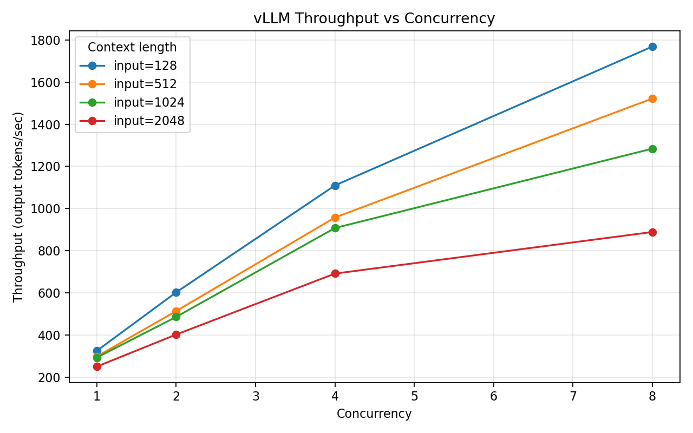
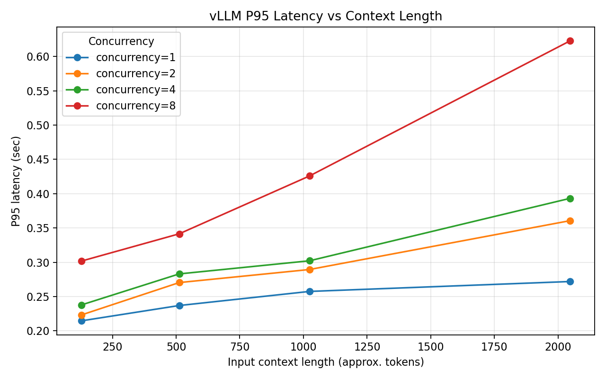

# vLLM / PagedAttention Serving Benchmark

## Serving Baseline

Goal: run a reproducible vLLM serving baseline before expanding to the full batch/context benchmark matrix.

### Environment

- GPU: NVIDIA GeForce RTX 4080, 16GB VRAM
- Driver: 596.21
- CUDA reported by `nvidia-smi`: 13.2
- Runtime: Docker
- vLLM image: `vllm/vllm-openai:latest`
- Model: `Qwen/Qwen3-0.6B`
- API port: `8000`

### Docker GPU Validation

The host GPU was visible through `nvidia-smi`. Docker GPU access required NVIDIA Container Toolkit.

After configuring the NVIDIA runtime:

```bash
sudo nvidia-ctk runtime configure --runtime=docker
sudo systemctl restart docker
```

GPU access inside Docker can be validated with:

```bash
sudo docker run --rm --gpus all nvidia/cuda:12.4.1-base-ubuntu22.04 nvidia-smi
```

### vLLM Serving Command

The first launch failed because the default vLLM GPU memory utilization target was slightly higher than the free VRAM available on startup. The baseline therefore uses `--gpu-memory-utilization 0.80` for a stable local setup.

```bash
sudo docker run --runtime nvidia --gpus all \
  -v ~/.cache/huggingface:/root/.cache/huggingface \
  --env "HF_TOKEN=$HF_TOKEN" \
  -p 8000:8000 \
  --ipc=host \
  vllm/vllm-openai:latest \
  --model Qwen/Qwen3-0.6B \
  --gpu-memory-utilization 0.80
```

### Validation

Model endpoint:

```bash
curl http://localhost:8000/v1/models
```

Observed result:

```json
{
  "object": "list",
  "data": [
    {
      "id": "Qwen/Qwen3-0.6B",
      "object": "model",
      "owned_by": "vllm",
      "root": "Qwen/Qwen3-0.6B",
      "max_model_len": 40960
    }
  ]
}
```

### Notes

- `--gpu-memory-utilization` controls the total GPU memory budget vLLM may use, not just the model weight size.
- The 0.6B model weights are small, but vLLM also reserves memory for KV cache, runtime buffers, CUDA graphs, and serving concurrency.

## Batch / Context Serving Benchmark

Goal: measure how vLLM serving performance changes as input context length and concurrency increase.

### Benchmark Methodology

The benchmark script sends OpenAI-compatible completion requests to the local vLLM server:

```bash
python scripts/benchmark_serving.py \
  --base-url http://localhost:8000 \
  --model Qwen/Qwen3-0.6B \
  --input-tokens 128,512,1024,2048 \
  --output-tokens 64 \
  --concurrency 1,2,4,8 \
  --num-requests 32 \
  --output results/serving_benchmark.csv
```

Experiment matrix:

- Input context length: `128`, `512`, `1024`, `2048` approximate tokens
- Output length: `64` generated tokens
- Concurrency: `1`, `2`, `4`, `8`
- Requests per case: `32`
- Total cases: `4 x 1 x 4 = 16`

The script records:

- request throughput: completed requests per second
- token throughput: generated output tokens per second
- p50 latency: median request latency
- p95 latency: tail latency

### Results Summary

| Input tokens | Concurrency | Tok/s | Req/s | P50 latency (s) | P95 latency (s) |
|---:|---:|---:|---:|---:|---:|
| 128 | 1 | 324.7 | 5.07 | 0.194 | 0.215 |
| 128 | 2 | 602.3 | 9.41 | 0.207 | 0.223 |
| 128 | 4 | 1109.5 | 17.34 | 0.234 | 0.238 |
| 128 | 8 | 1769.0 | 27.64 | 0.288 | 0.302 |
| 512 | 1 | 297.7 | 4.65 | 0.211 | 0.237 |
| 512 | 2 | 513.4 | 8.02 | 0.245 | 0.270 |
| 512 | 4 | 957.3 | 14.96 | 0.263 | 0.283 |
| 512 | 8 | 1522.1 | 23.78 | 0.339 | 0.341 |
| 1024 | 1 | 292.5 | 4.57 | 0.213 | 0.257 |
| 1024 | 2 | 485.7 | 7.59 | 0.261 | 0.289 |
| 1024 | 4 | 907.4 | 14.18 | 0.283 | 0.302 |
| 1024 | 8 | 1284.2 | 20.07 | 0.389 | 0.426 |
| 2048 | 1 | 249.8 | 3.90 | 0.248 | 0.272 |
| 2048 | 2 | 401.8 | 6.28 | 0.305 | 0.361 |
| 2048 | 4 | 691.1 | 10.80 | 0.370 | 0.393 |
| 2048 | 8 | 888.5 | 13.88 | 0.550 | 0.623 |

### Figures

Throughput increases with concurrency, but shorter contexts scale better:



Tail latency increases as input context length grows, especially at higher concurrency:



### Key Observations

1. **Concurrency improves throughput.** For 128-token inputs, throughput increases from `324.7 tok/s` at concurrency 1 to `1769.0 tok/s` at concurrency 8.
2. **Longer context reduces throughput.** At concurrency 8, throughput drops from `1769.0 tok/s` for 128-token inputs to `888.5 tok/s` for 2048-token inputs.
3. **Longer context increases tail latency.** At concurrency 8, p95 latency grows from `0.302s` for 128-token inputs to `0.623s` for 2048-token inputs.
4. **Serving scalability is a memory-and-scheduling problem, not only a model-size problem.** Even with a small 0.6B model, KV cache and concurrent requests affect latency and throughput.

### Limitations

- Prompt length is approximate because the script generates whitespace-separated synthetic prompts instead of tokenizer-exact prompts.
- The benchmark uses one small model, one GPU, and one fixed output length.
- The results are best interpreted as local serving behavior on this RTX 4080 setup, not as universal vLLM performance numbers.

### Reproducibility

Raw CSV:

```text
results/serving_benchmark.csv
```

Plot command:

```bash
python scripts/plot_results.py \
  --input results/serving_benchmark.csv \
  --output-dir figures
```

Generated figures:

```text
figures/throughput_vs_concurrency.png
figures/latency_vs_context.png
```

### Status

Completed: benchmark results were summarized into a table, plotted, and documented.
